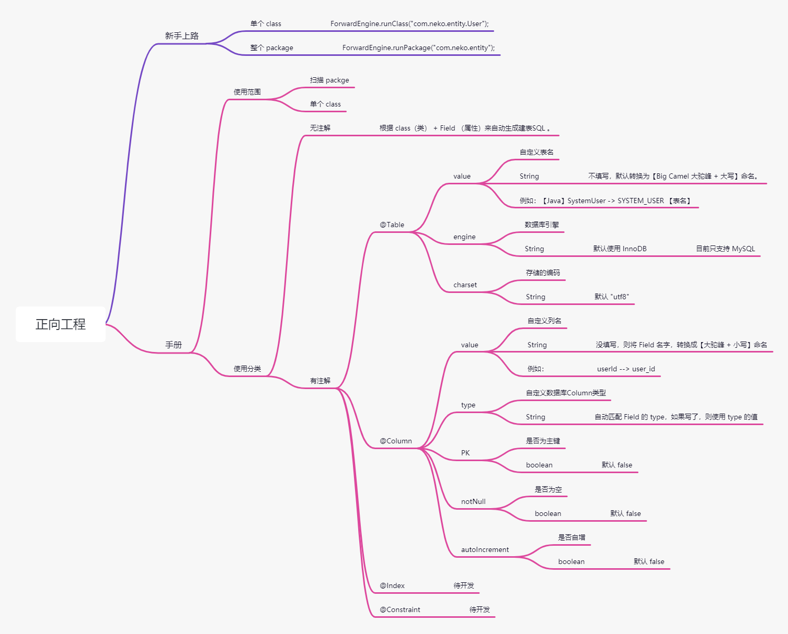

# Forward Engineer 正向工程 0.0.4

> @author: SolarisNeko 
>
> @startDate: Saturday，03/07/2021

## 快速上手

下载 jar 包

https://gitee.com/SolarisNeko/forward-engineering/releases

```java
// 针对单个 class
ForwardEngine.runClass("com.neko.entity.SystemUser");

// 或者 

// 扫描 package
ForwardEngine.runPackage("com.neko.entity");
```


## 示意图
见 /README.assets/ForwardEngineer 正向工程.png



# 进度

## 1、目前进度

1. 使用 **@Table、@Column** 生成 [细粒度的建表SQL] 。
2. 包扫描、单个文件，生成SQL
3. 已加入对 **原生 Pojo** 的 `无侵入支持`
4. 生成 .sql 文件

## 2、未来计划

1. 加入 **@Constraint** 支持 。
2. 加入对 **@Index** 支持。
3. 加入对 @Table, @Column 的 comment 解释支持。


------

# 介绍

## 1、preface 前言

​	Author still learning, is a Rookie.

​	Give me some issue make me think it is cool .

> 作者是一个菜鸟，还在学习。
>
> 开源，希望大家给我一些很 cool 的建议~

## 2、Origin Intention 初衷

### 原因 1

​	公司有一个框架，用 `java` 写 `SQL`，维护表结构。

​	虽然 **高度封装 API** , 但依旧非常麻烦.

​	在某些 Table 设计不合理下，很辛苦，比我写 SQL 慢太多了（慢1000%+) 。

> 1、Java 即 SQL

### 原因 2

​	同时，随着时代发展，我们的 Table 逐渐去除 FK（Foreign Key），当 Table 命名不规范的时候，你根本不知道一些==字段的关联关系==。

> 2、Table 关系可视化


---------

# 补充

​	目前代码中，很多注释，很乱。一定版本迭代后，会重新梳理。

​	目前注释只是为了记录详细一点，好让我思路不中断。

​	希望大家能提出很 cool 的建议~

